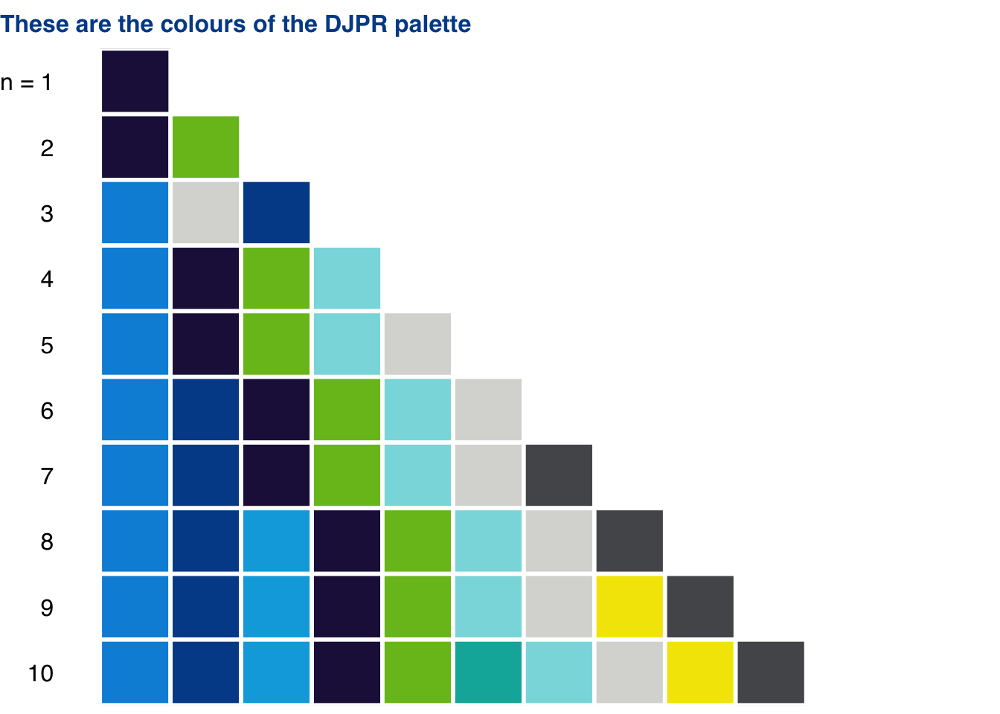

<!-- README.md is generated from README.Rmd. Please edit that file -->

# djprtheme

<!-- badges: start -->

[](https://lifecycle.r-lib.org/articles/stages.html#experimental)
[](https://github.com/djpr-data/djprtheme/actions)
[](https://codecov.io/gh/djpr-data/djprtheme?branch=main)
<!-- badges: end -->

**This package is still under active development**

The goal of `djprtheme` is to enable users to easily create ggplot2
charts that look good and are consistent with the style guide of the
Victorian Department of Jobs, Precincts and Regions.

## Installation

You can install `djprtheme` from [GitHub](https://github.com/) with:

``` r
# install.packages("devtools")
devtools::install_github("djpr-data/djprtheme")
```

## The DJPR palette

You can style your plots with the DJPR palette using the
`djpr_colour_manual()` and `djpr_fill_manual()` functions. You should
specify the number of colours in your plot. These are the colours that
will be used in your plot:


